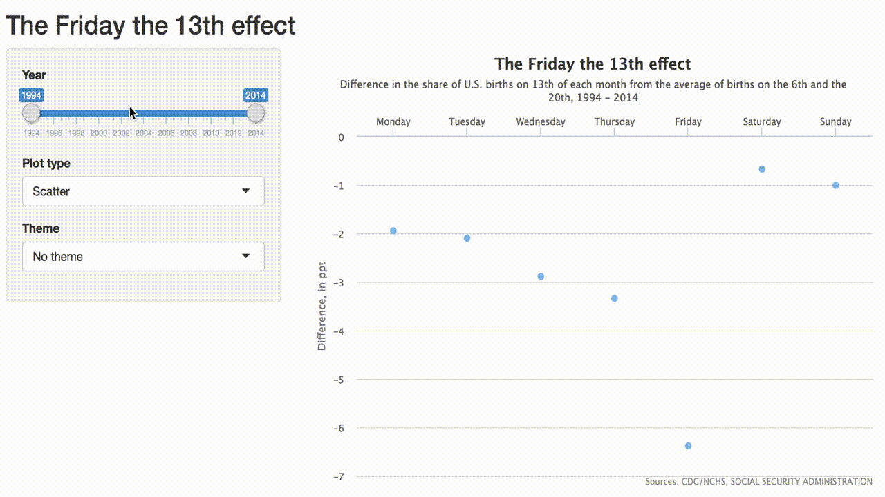

```{r setup, include=FALSE}
knitr::opts_chunk$set(echo = TRUE)
```

### Highcharts

Highcharts is an interactive JavaScript charting library. Highcharts offers three products:

1. **Highcharts** which supports a variety of plots, from your standard line plot to bar charts, pie charts, bubble plots, etc. For a full list of highcharts options see [here](http://www.highcharts.com/products/highcharts).

2. **Highstock** which is useful for crating time series charts, e.g. stock prices over time. It has attractive built in options like navigator series, preset date ranges, a date picker, scrolling, and panning.
    
3. **Highmaps** which is for plotting spatial data on to maps, e.g. sales, election results, etc.

All products in this library are free for non-commercial use. For use in commercial projects and websites, see https://shop.highsoft.com/.

As an aside, Highcharts has a cute background story:

> Our best selling product, Highcharts, started out as Torstein’s humble quest for a simple charting tool for updating his homepage with snow depth measurements from Vikjafjellet, the local mountain where his family keeps a cabin. Frustrated with the common flash plug-ins, and other proprietary solutions at the time, he decided to build a standards-based solution of his own, and share it with the world.

Source: http://www.highcharts.com/about

### highcharter

The `highcharter` package, by [Joshua Kunst](https://github.com/jbkunst), is an R wrapper for the Highcharts javascript library. The package enables the creation of Highcharts type plots within R.

```{r message=FALSE}
library(highcharter)
```

There are two main functions in the package:

- `highchart`: Creates a Highchart chart object using htmlwidgets. The widget can be rendered on HTML pages generated from R Markdown, Shiny, or other applications. 
- `hchart`: Uses highchart to draw aplot for different R object classes using a convenient single command. Specifically, it can plot data frames, numeric, histogram, character, density, factors, ts, mts, xts, stl, ohlc, acf, forecast, mforecast, ets, igraph, dist, dendrogram, phylo, and survfit classes.

Plots are built in the spirit of `ggplot2` by layering, however they use the pipe operator (`%>%`) instead of `+`.

Other attractive features of the package are:

- Theming: It is possible to configure your plots with pre-implemented themes like Economist, Financial Times, Google, and FiveThirtyEight among others.
- Plugins: Motion, drag points, fontawesome, url-pattern, annotations.

We will demonstrate the functionality of this package as well as of Highcharts in general through a series of visualisation examples.

### Example 1: US births on Friday the 13th

The inspiration for this visualization is a FiveThirtyEight article titled [Some People Are Too Superstitious To Have A Baby On Friday The 13th](http://fivethirtyeight.com/features/some-people-are-too-superstitious-to-have-a-baby-on-friday-the-13th/). FiveThirtyEight generously makes the data used in (some of) their articles available on their [GitHub repository](https://github.com/fivethirtyeight/data). The data used in this particular analysis can be found [here](https://github.com/fivethirtyeight/data/tree/master/births).

Our goal is to recreate [this particular visualization](http://i2.wp.com/espnfivethirtyeight.files.wordpress.com/2016/05/bialik-fridaythe13th-2.png?quality=90&strip=all&w=1150&ssl=1). In order to do so we need to calculate the differences between the number of births on the 13th and the average of 6th and 20th of each month, and aggregate these values for the days of the week, nothing a bit of `dplyr` and `tidyr` can't handle.

Let's load the necessary packages:

```{r load-packages, message = FALSE}
library(dplyr)
library(tidyr)
```

and the data:

```{r load-data}
births <- read.csv("data/births.csv")
```

Then we'll calculate the differences in births as described in the article and store the results in a new data frame called `diff13`:

```{r calculate-thirteen-diff}
diff13 <- births %>%
  filter(date_of_month %in% c(6, 13, 20)) %>%
  mutate(day = ifelse(date_of_month == 13, "thirteen", "not_thirteen")) %>%
  group_by(day_of_week, day) %>%
  summarise(mean_births = mean(births)) %>%
  arrange(day_of_week) %>%
  spread(day, mean_births) %>%
  mutate(diff_ppt = ((thirteen - not_thirteen) / not_thirteen) * 100)
```

which looks like:

```{r view-thirteen-diff, echo = FALSE}
diff13
```

Note that the calculated percentage point differences (`diff_ppt`) may not match the ones in the visualization in the FiveThirtyEight article. There are two reaons for this: 

1. Holidays are excluded in the FiveThirtyEight but not in this analysis. 
2. Two data files are provided by FiveThirtyEight, one for years 1994 to 2003 and another for years 2000 to 2014. The numbers of births for the overlapping years (2000 - 2003) are not exactly the same. This app uses the SSA data for these years, however it is unclear which data source FiveThirtyEight used for these years.

Let's start by making a very simple highchart of these data using the `hchart` function:

```{r diff13-simple-scatter}
hchart(diff13, "scatter", x = day_of_week, y = diff_ppt)
```

This plot has some attractive features. For example, if you hover over the points you should be able to view the actual values of the plotted data. But we need to do some customization to make the plot look like the one in the FiveThirtyEight article. We can achieve that using the `highchart` function along with some customization functions. Note that we separate the layer with the pipe operator.

```{r diff13-barchart-538}
highchart() %>%
  hc_add_series(data = round(diff13$diff_ppt, 4), type = "column",
                name = "Difference, in ppt",
                color = "#F0A1EA", showInLegend = FALSE) %>%
  hc_yAxis(title = list(text = "Difference, in ppt"), allowDecimals = FALSE) %>%
  hc_xAxis(categories = c("Monday", "Tuesday", "Wednesday", "Thursday", 
                          "Friday", "Saturday", "Sunday"),
           tickmarkPlacement = "on",
           opposite = TRUE) %>%
  hc_title(text = "The Friday the 13th effect",
           style = list(fontWeight = "bold")) %>% 
  hc_subtitle(text = "Difference in the share of U.S. births on 13th of each month 
                     from the average of births on the 6th and the 20th,
                     1994 - 2004") %>%
  hc_tooltip(valueDecimals = 4,
             pointFormat = "Day: {point.x} <br> Diff: {point.y}") %>%
  hc_credits(enabled = TRUE, 
             text = "Sources: CDC/NCHS, SOCIAL SECURITY ADMINISTRATION",
             style = list(fontSize = "10px")) %>%
  hc_add_theme(hc_theme_538())
```

Once again, an attractive feature of this visualization is the hover tooltip. Themes also make it easy to change the look of the plot (in this case using `hc_theme_538()` gets us very close to the orignal visualization). Additionally, we are able to easily change labels (e.g., names of days) without having to make changes in the original data. 

### Example 2: US births on Friday the 13th, an interactive look

Since the `highcharter` package is powered by htmlwidlgets, it is also Shiny compatible! In order to build a highchart within a Shiny app, we use the `renderHighchart` function.

We have built an app that extends the visualization we created earlier, allowing for custom selection of years plotted, type of plot, and theme. A screenshot of the app is shown below, and you can view the app and the source code [here](https://gallery.shinyapps.io/highcharter-births/).

<br>

[](https://gallery.shinyapps.io/highcharter-births/)

<br>

### Other examples

The `highcharter` package [homepage](http://jkunst.com/highcharter/) hosts a variety of highcharts, highstocks, and highmaps plots along with sample code to reproduce them. If you're interested in finding out more about the functionality of the package I highly recommend browsing their site.

Additionally the [Highcharts Options Reference](http://api.highcharts.com/highcharts) page is immensely useful for finding specific syntax for customization options.

### Summary

Highcharts provides high quality web graphics with high customizability. The built in and customizable hover/tooltip box and zooming functionality seems to be its most attractive features. However whether or not these features would be useful for you depends on your use case. 

For example, the tooltip is not as useful if you are plotting data with larger sample sizes. Take a look at this plot of arrival vs. departure delays of flights headed to Los Angeles (LAX) in October 2013 from the various New York airports. The overplotting on the lower left of the plot makes the hovering functionality not that useful.

```{r highchart-nycflights}
library(nycflights13)
oct_lax_flights <- flights %>%
  filter(month == 10, dest == "LAX")
hchart(oct_lax_flights, "scatter", x = dep_delay, y = arr_delay, group = origin)
```

However if we aggregated the data a bit to reduce the number of points plotted, this functionality could once again come in handy. For example, below we group the flights by 15-minute intervals in departure delays, and plot the median arrival delay for these intervals.

```{r highchart-nycflights-aggregate}
oct_lax_flights_agg <- oct_lax_flights %>%
  mutate(dep_delay_cat = cut(dep_delay, breaks = seq(-15, 255, 15))) %>%
  group_by(origin, dep_delay_cat) %>%
  summarise(med_arr_delay = median(arr_delay, na.rm = TRUE))
hchart(oct_lax_flights_agg, "line", x = dep_delay_cat, y = med_arr_delay, group = origin)
```

